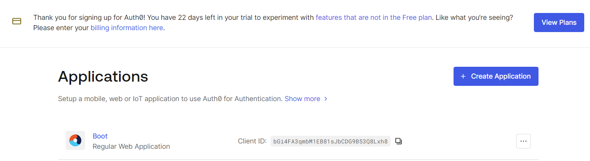
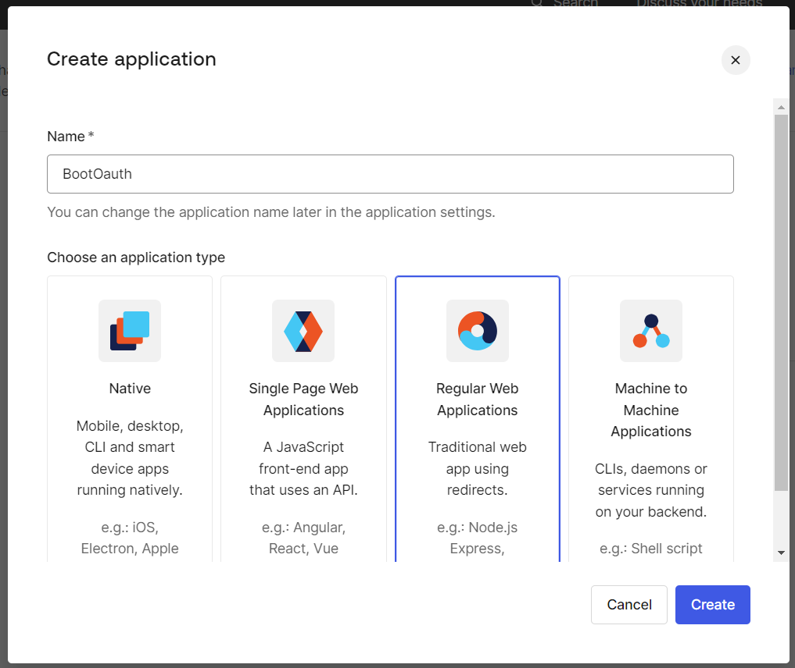
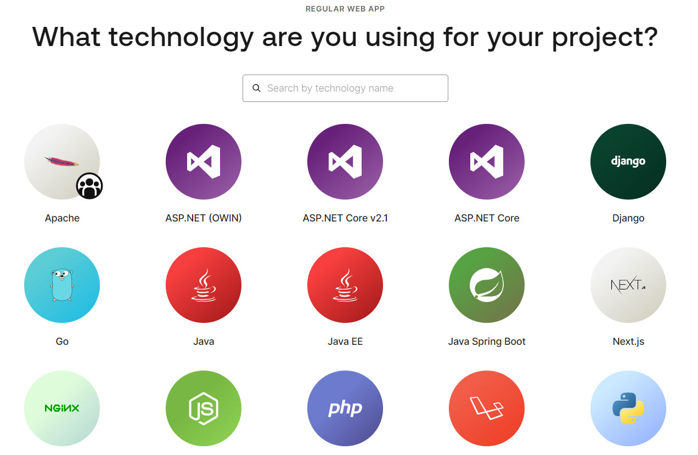
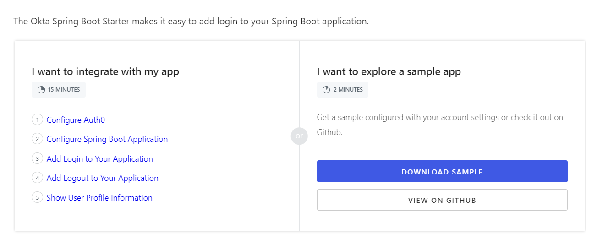
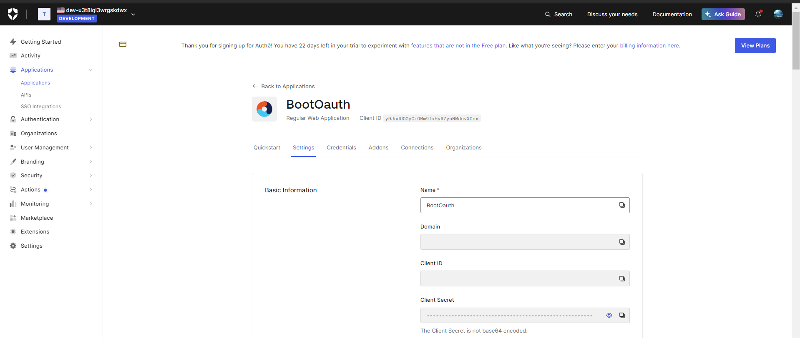

# Spring Oauth

Esse repositório, implmenta um exemplo simples uma aplicação Rest, utilizando o [auth0](https://auth0.com/) e Oauth para fazer acessar os recursos da API.
Para que você consiga utilizar essa API, será necessário se registrar junto ao auth0, e acessar o [dashboard](https://manage.auth0.com/dashboard/).
No menu esquerdo em Application



Crie uma nova aplicação


Selecione a sua arquitetura


Caso hajam dúvidas, siga a documentação





Esses atributos deverão ser configurados posteriormete no *application.properties*.

Domain: 

Client ID:

Client Secret

spring.application.name=OauthClient

Editar o application.properties inserindo as informações obtidas do application do auth0.
```
spring.security.oauth2.client.registration.auth0.provider=auth0
spring.security.oauth2.client.registration.auth0.redirect-uri={baseUrl}/login/oauth2/code/{registrationId}
spring.security.oauth2.client.registration.auth0.scope=openid
spring.security.oauth2.client.registration.auth0.client-id=your_client_id
spring.security.oauth2.client.registration.auth0.client-secret=your_client_secret
spring.security.oauth2.client.registration.auth0.authorization-grant-type=authorization_code
spring.security.oauth2.client.registration.auth0.client-authentication-method=client_secret_basic
spring.security.oauth2.client.provider.auth0.issuer-uri=https://your_domain/
```